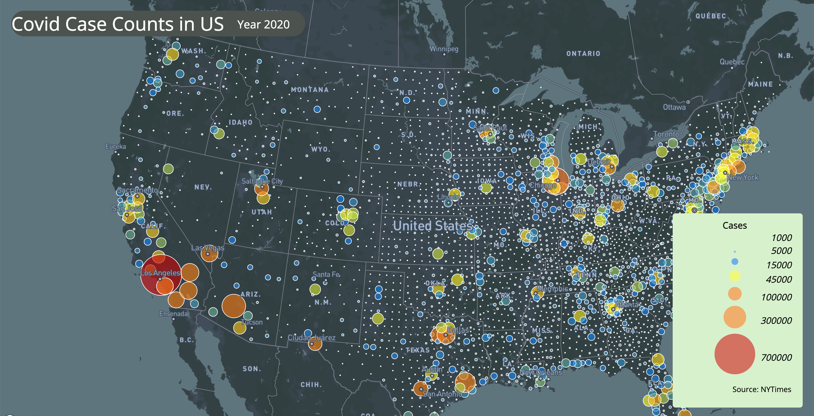

# # *Civid-19 Thematic maps*
                - Peter Haoyang Zhou

### This projects contains two thematic maps that shows the intensity of the Covid-19 outbreak that took place in 2020 across the United States
### The first thematic map is a proportional symbol map. This map shows the absolute, total cases in each county with interactive bubbles that contains the state, county, and the number of total recorded cases. Here's a snapshot:

### The second thematic map is a choropleth map. This map fills the county polygon with color 

